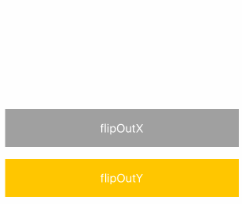
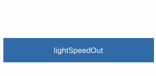
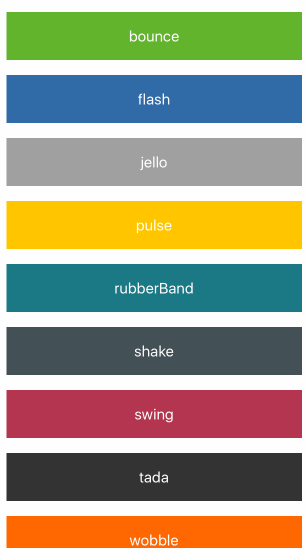
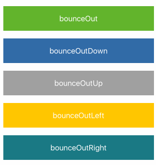
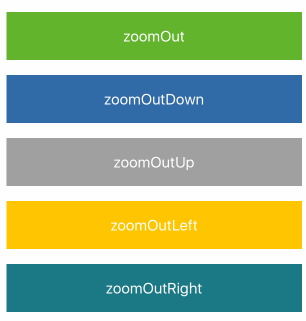
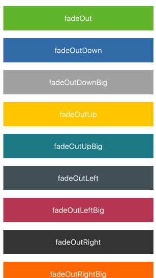
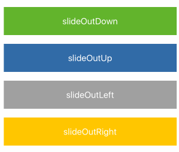

## Animation

Bring animations to your Native application by placing content in the animate widget.

#### Usage

-   Place the widget on the page
-   Place the content inside the content section
-   Select the animation
-   Optional set the conditions based on time, visibilty or expression

### Animations

We group the animation effect in 3 categories; entrance, attention and exits;

#### Entrance

Bounce  

Fading  

Sliding  

Zooming  

Flip  

Light speed  

#### Attention

#### Exits

Bounce  

Zooming  

Fading  

Sliding  

Flipping  

Light speed  

### Easing

Easing functions specify the rate of change of a animations over time.

Objects in real life don’t just start and stop instantly, and almost never move at a constant speed. When we open a
drawer, we first move it quickly, and slow it down as it comes out. Drop something on the floor, and it will first
accelerate downwards, and then bounce back up after hitting the floor.

For live samples see: https://easings.net/en#
