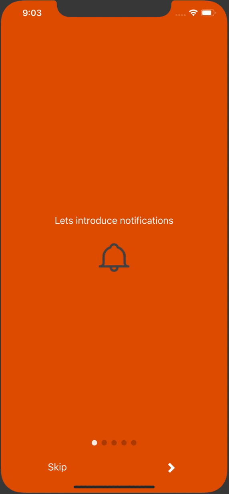
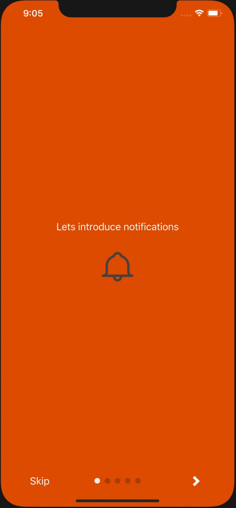
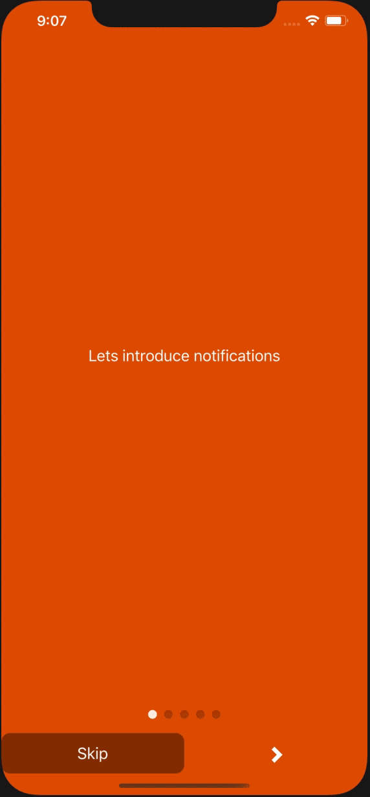

# Intro screen widget

Displays swipeable contents with buttons to proceed or go back and pagination.

## Available patterns

### Pagination above



### Pagination between



## Using Custom styles



You can define your styles through Atlas using the following properties:

```$js
export const myCustomStyle = {
    fullscreenContainer: ViewStyle;
    popupContainer: ViewStyle;
    paginationContainer: ViewStyle;
    paginationText: TextStyle;
    dotStyle: ViewStyle;
    activeDotStyle: ViewStyle;
    paginationAbove: {
        buttonsContainer: ViewStyle;
        buttonSkip: {
            container: ViewStyle;
            caption: TextStyle;
            icon: {
                color: string;
                size?: number;
            };
        }
        buttonDone: {
            container: ViewStyle;
            caption: TextStyle;
            icon: {
                color: string;
                size?: number;
            };
        }
        buttonPrevious: {
            container: ViewStyle;
            caption: TextStyle;
            icon: {
                color: string;
                size?: number;
            };
        }
        buttonNext: {
            container: ViewStyle;
            caption: TextStyle;
            icon: {
                color: string;
                size?: number;
            };
        }
    };
    paginationBetween: {
        buttonSkip: {
            container: ViewStyle;
            caption: TextStyle;
            icon: {
                color: string;
                size?: number;
            };
        }
        buttonDone: {
            container: ViewStyle;
            caption: TextStyle;
            icon: {
                color: string;
                size?: number;
            };
        }
        buttonPrevious: {
            container: ViewStyle;
            caption: TextStyle;
            icon: {
                color: string;
                size?: number;
            };
        }
        buttonNext: {
            container: ViewStyle;
            caption: TextStyle;
            icon: {
                color: string;
                size?: number;
            };
        }
    };
}
```

Check the official documentation for further information about ViewStyle and TextStyle
`https://facebook.github.io/react-native/docs/view-style-props` and
`https://facebook.github.io/react-native/docs/text-style-props`
