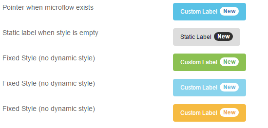
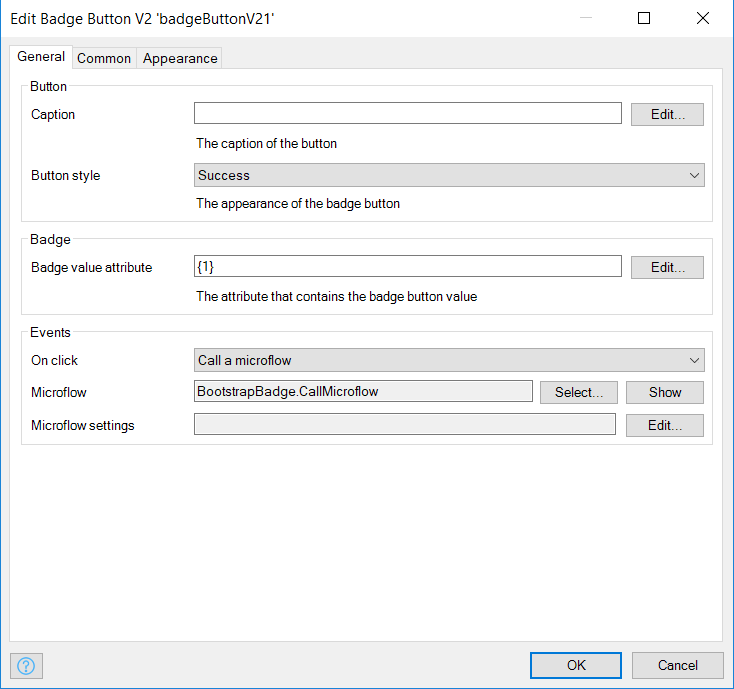

## Badge Button

A special distinctive mark or token put on any display as a button

## Features

-   Display a badge on a button.
-   Set attributes for label and badge using text template
-   Trigger actions on click (Call nanoflow, microflow, open page, close, etc..)

## Dependencies

Mendix 8.0

## Demo project

[https://badgebutton.mxapps.io/](https://badgebutton.mxapps.io/)

## Usage

Just drag and drop the badge button inside or outside a context.

The data source attribute specified in the `Badge` tab is optional. If not set, static data should be specified in the
`Button` tab.

