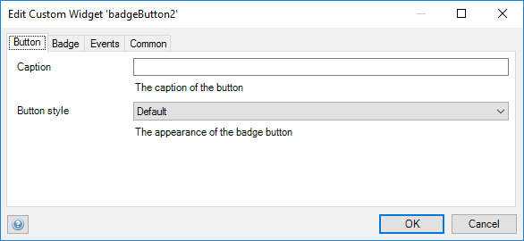
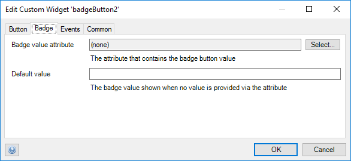
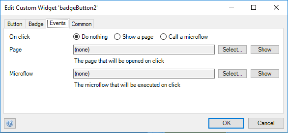

## Badge Button

A special distinctive mark or token put on any display as a button

## Features

-   Display a badge on a button.
-   Attach an onclick microflow
-   Attach an onclick nanoflow
-   Set static data when the persisted data is not specified

## Dependencies

Mendix 7.13.1

## Demo project

[https://badgebutton.mxapps.io/](https://badgebutton.mxapps.io/)

## Usage

Place the widget in the context of an object that has a value attribute.

The data source attribute specified in the `Badge` tab is optional. If not set, static data should be specified in the
`Button` tab.

 

