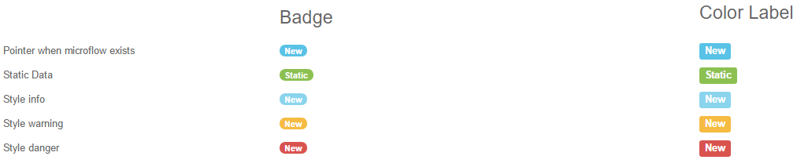

## Badge

Show a numerical indicator of how many items are associated with a link

## Features

 * Display a badge on a label
 * Display as a badge or a color label
 * Attach an onclick microflow
 * Set a static label text when the dynamic label is not specified
 * Set a static data text when the dynamic data is not specified

## Dependencies

Mendix 7.1

## Usage
Place the widget in the context of an object that has a label attribute, value attribute and bootstrap style attribute.

The data source attributes specified in the `Data source` tab are optional. If not set, static data should be specified in the `Display` tab.

## Demo project

[https://badge.mxapps.io/](https://badge.mxapps.io/)

## Issues, suggestions and feature requests

We are actively maintaining this widget, please report any issues or suggestion for improvement at
https://github.com/mendixlabs/badge/issues.

## Development
Prerequisite: Install git, node package manager, webpack CLI, grunt CLI, Karma CLI

To contribute, fork and clone.

    git clone https://github.com/mendixlabs/badge.git

The code is in typescript. Use a typescript IDE of your choice, like Visual Studio Code or WebStorm.

To set up the development environment, run:

    npm install

Create a folder named dist in the project root.

Create a Mendix test project in the dist folder and rename its root folder to `dist/MxTestProject`. Changes to the widget code shall be automatically pushed to this test project.

[https://github.com/MendixLabs/badge/releases/download/v1.1.0/Badge.mpr](https://github.com/MendixLabs/badge/releases/download/v1.1.0/Badge.mpr)

To automatically compile, bundle and push code changes to the running test project, run:

    grunt

To run the project unit tests with code coverage, results can be found at dist/testresults/coverage/index.html, run:

    npm test

or run the test continuously during development:

    karma start
