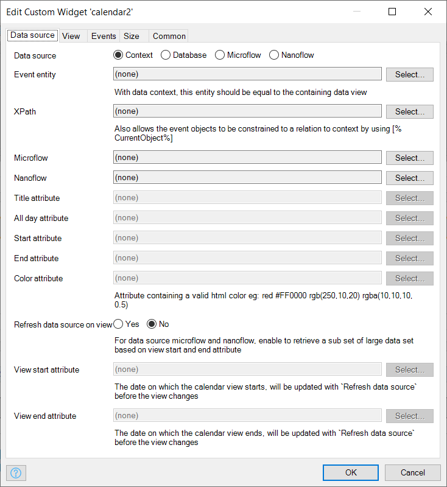
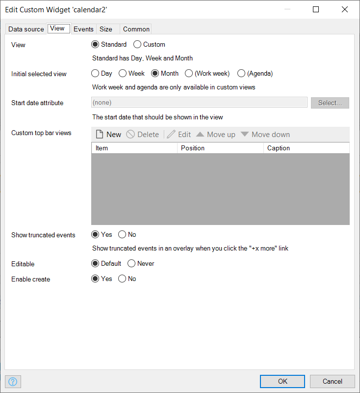
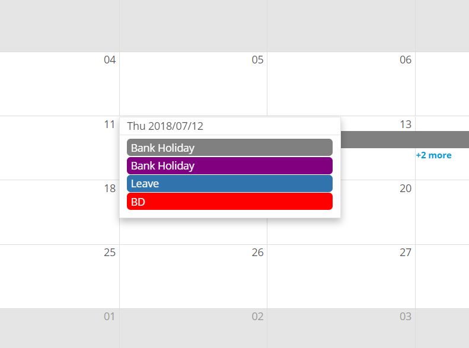
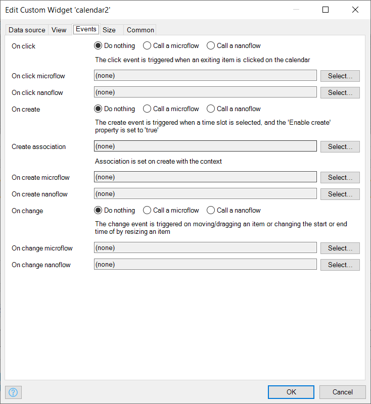

# Calendar

Display and manage calendar events

## Features

-   Add and edit calendar events
-   Drag and drop calendar events
-   Change calendar event color
-   Retrieve events based on selected date ranges

## Dependencies

-   Mendix 7.15.1

## Development test project

[https://reactcalendar.mxapps.io](https://reactcalendar.mxapps.io)

## Basic configuration

-   Place the widget in data form within the context of the event entity
-   Calendar event can be retrieved from the database by context, xpath, microflow or nanoflow
-   Select the event entity
-   For data source `Microflow`, select a `Data source microflow` and for data source `Nanoflow`, select a
    `Data source nanoflow`
-   Select attributes to provide the event `Title`, `start date`, `end date`, `color` and a boolean attribute to
    determine whether the event should be considered `all day`
-   Setting up `Refresh data source on view`, retrieve data by microflow (Data source = Microflow) and add a constraint
    based on the `View start attribute` and the `View end attribute`. _E.g. [End > $CalenderView/StartAttribute and
    Start < $CalenderView/EndAttribute]_ When navigating through the calendar, only event that lie with in the
    `View start attribute` and `View end attribute` dates will be retrieved.

-   `Standard` view has `day`, `week` and `month` view only
-   To set a `Custom toolbar`, select `Custom` view
-   `Month` is the default view
-   `Start position attribute` is optional

-   Truncated events are shown in an overlay when you click the `+x more` link

-   There are three types of `Events`
-   There are two click events. Clicking on a `calendar event` and clicking on a `day slot`
-   The third event is the change event
-   There two change events as well. `Drag and drop` plus `event resizing`

