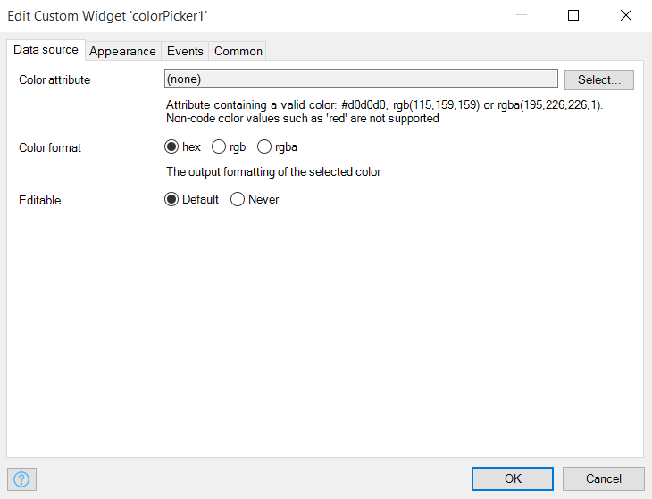

# Color-picker

Select and adjust a color value

## Features

-   Render using different modes i.e. Button, Input box, or Inline
-   Execute an action after color change: microflow or nanoflow
-   Add a label and label width
-   Support color format of hex, rgb or rgba

## Supported color pickers

Based on the color picker library
[http://casesandberg.github.io/react-color/](http://casesandberg.github.io/react-color/)

-   Sketch
-   Chrome
-   Block
-   Github
-   Twitter
-   Circle
-   Hue
-   Slider
-   Compact
-   Material
-   Swatches

## Dependencies

-   Mendix 7.14.1

## Development test project

[https://colorpicker.mxapps.io](https://colorpicker.mxapps.io)

## Basic configuration

-   Create an entity with a string attribute, to store the color value
-   Place the widget in data form within the context of the entity
-   Select the attribtue for the color
-   Optional change the rendering and appearance properties to your need. |
