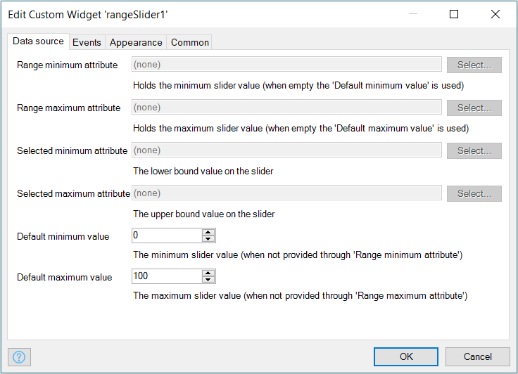

# Range Slider

Change a range of values using a slider.

## Features

-   Adjust lower bound and upper bound values on the slider
-   Execute a microflow when a slider value is changed or clicked
-   Show or hide a tooltip on hover
-   Render range slider with different bootstrap colors

## Dependencies

Mendix 7.4

## Basic configuration

-   `Range minimum attribute` - The attribute that contains the `minimum` slider value, if not provided, 'Default
    minimum value' is used.
-   `Range maximum attribute` - The attribute that contains the `maximum` slider value, if not provided, 'Default
    maximum value' is used.
-   `Selected minimum attribute` - The attribute that contains the `minimum` bound slider value.
-   `Selected maximum attribute` - The attribute that contains the `maximum` bound slider value.

## Usage

The `Range slider` allows a user to set two values between two bounds (minimum value and maximum value) However, if
there is only one value that needs to be set between two bounds, download the slider from
[appstore](https://appstore.home.mendix.com/link/app/48786/Mendix/Slider) or from
[github](https://github.com/mendix/widgets-resources/tree/master/packages-web/slider) instead.

From the modeler place the widget in the context of an object that has attributes for maximum value, minimum value,
lower bound value and upper bound value

The maximum and minimum values determine the range within which the range slider values can be adjusted.

The step value determines the next point to shift to when sliding (interval between to points or numbers).

For the step value, the difference between the maximum value and the minimum value should be divisible by 2. i.e.

    (maximumValue - minimumValue) % 2 = 0

## Demo project

https://rangeslider.mxapps.io/
