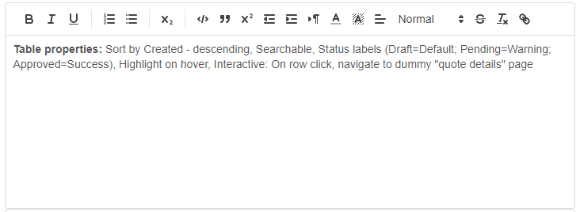
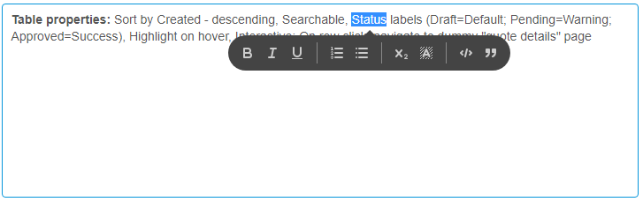

# Rich Text

Rich inline or toolbar text editing

## Features

-   Format selected text
-   HTML output of formatted text
-   Show editor options either on a toolbar or as a bubble
-   Use the custom option to select which editing options you want to show
-   Input and display text is sanitized.

### Keyboard shortcuts

-   Ctrl + B: Bold
-   Ctrl + I: Italic
-   Ctrl + U: Underline
-   Ctrl + Z: Undo
-   Ctrl + Y: Redo
-   Ctrl + C: Copy
-   Ctrl + V: Paste
-   -, space : start list
-   tab: indents the content when tab key is configured to indent from the widget xml else it will move focus to next
    element

## Dependencies

Mendix 7.13.1

## Test project

http://texteditorwidget.mxapps.io 

## Usage

Place the widget in a data view, list view or template grid with a data source that has a string attribute and select
the 'Value attribute' that contains the editable text.

## HTML content

Please note, that the input and output is sanitized. All unsupported HTML tags and JavaScript is removed for security
reasons. Supports:

-   Tags: h1, h2, h3, h4, h5, h6, p, br, a, ul, li, ol, s, u, em, pre, strong, blockquote, span
-   Attributes:
    -   for all tags: class, style
    -   `a` tag: href, name, target
-   Schemes: http, https, ftp, mailto

**Please note**: To be fully secure, all user HTML input should be sanitized on the server side too. This could be done
with the `XSSSanitize` action found in the Community Commons https://appstore.home.mendix.com/link/app/170/ When the
option 'Sanitize content' is set to 'false' server side sanitating is required before showing any HTML content.
