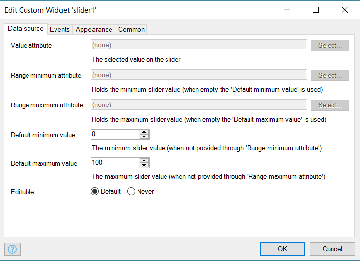
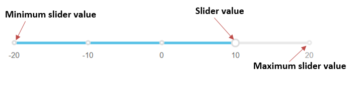
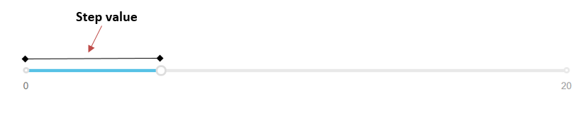

# Slider

Change a number value using a slider

## Features

-   Adjust the slider value
-   Execute a microflow when a slider value is changed or clicked
-   Show a tooltip on hover
-   Render slider with different bootstrap colors

## Dependencies

Mendix 7.14

## Demo project

https://slider.mxapps.io/

## Basic configuration

-   `Value attribute` - The selected value on the slider.
-   `Range minimum attribute` - The attribute that contains the `minimum` slider value, if not provided, 'Default
    minimum value' will be used.
-   `Range maximum attribute` - The attribute that contains the `maximum` slider value, if not provided, 'Default
    maximum value' will be used.



## Usage

The `slider` allows a user to set a value between two bounds (minimum value and maximum value) However, if there are two
values that need to be set between two bounds, download the Range slider from
[appstore](https://appstore.home.mendix.com/link/app/52704/Mendix/Range-slider).



From the modeler place the widget in the context of an object that has attributes for maximum value, minimum value and
value

The maximum and minimum values determine the range within which the slider value can be adjusted.

The step value determines the next point to shift to when sliding (interval between to points or numbers).



Note when choosing the step value, the difference between the maximum value and the minimum value should be divisible
by 2. i.e.

```
(maximumValue - minimumValue) % 2 = 0
```
