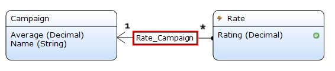
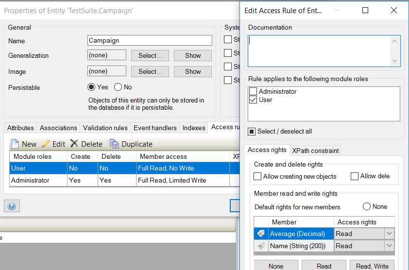
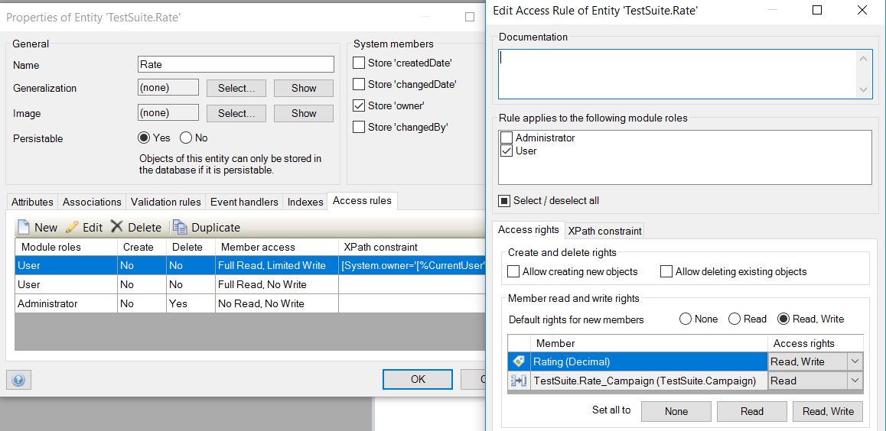

# Star rating
This widget lets users rate an object with stars from 1 to 5.

## Features
* Rate an object with stars
* Display average rating
* Display rating in whole and half stars
* Execute a microflow when the rate is changed

## Dependencies
Mendix 7.1

## Demo project
https://rating100.mxapps.io

## Usage
This widget requires a context.

### Configuration
#### DataSource
- `Rating Attribute` - dfdfd
- `Average Attribute` - 
- `OnCommit microflow` - Microflow which is fired when executing a commit once the vote/ rate has changed

#### Security
Security is a mandatory feature for rating and is considered seriously for proper use of this widget in a mendix project.
 - Model Configuration 
 - Campaign entity security: a User should only read the average attribute 
 - Rating or voting entity security: The user can only write their own rating 
 - [RateMe microflow](https://modelshare.mendix.com/models/d7ece331-49d4-4464-a2e2-ea75528a0367/rate-me) for the rate me custom button
 - [Calculate average microflow](https://modelshare.mendix.com/models/d27114b6-e2fb-4d79-aa39-8c60a6477ca8/calculate-average-rate)

## Issues
Please report issues at https://github.com/mendixlabs/star-rating/issues.

## Disclaimer
Status: In development

This widget should not be used in a production environment.
No guarantees are given that this works or keeps working, until it is officially released.

## Issues, suggestions and feature requests
We are actively maintaining this widget, please report any issues or suggestion for improvement at https://github.com/mendixlabs/star-rating/issues.

## Development
Prerequisite: Install git, node package manager, webpack CLI, grunt CLI, Karma CLI

To contribute, fork and clone.

    > git clone https://github.com/mendixlabs/star-rating.git

The code is in typescript. Use a typescript IDE of your choice, like Visual Studio Code or WebStorm.

To set up the development environment, run:

    > npm install

Create a folder named `dist` in the project root.

Create a Mendix test project in the dist folder and rename its root folder to `dist/MxTestProject`. Or get the test project from https://github.com/mendixlabs/star-rating/releases/download/1.0.0/TestStarRating.mpr. When Grunt is running changes to the widget code shall be automatically pushed to this test project.

To automatically compile, bundle and push code changes to the running Mendix test project, run:

    > grunt

To run the unit tests with code coverage, results can be found at `dist/testresults/coverage/index.html`, run:

    > npm test

or run the unit tests continuously during development:

    > karma start
