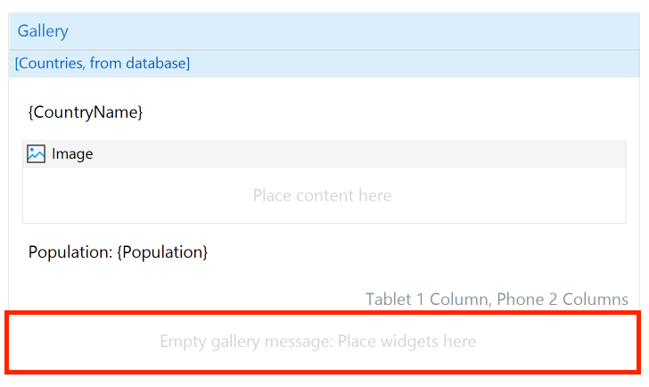
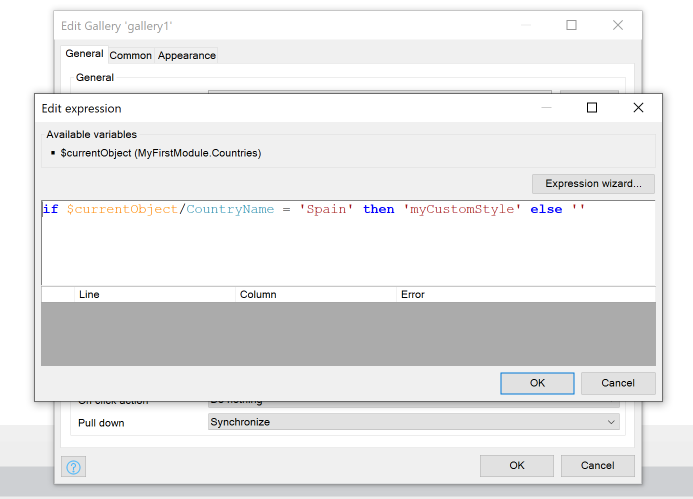

## Gallery

### 1 Introduction

The Gallery widget, a replacement for both the template grid and list view, helps you build beautiful lists and grids for tablet, and mobile devices. The Gallery widget provides options for varying columns per device type and gives you the power to create amazing grid and list experiences for every user.

### 1.2 Features

-   Pagination.
-   Empty list option.
-   Pull down event.
-   It can handle on Click events on each item.

## 2 Configuration

Several options can be defined in the Gallery widget:

### 2.1 Data Source

Data source specifies the source of the data being presented in the Gallery. You can select data from **Database**, **Nanoflow**, or **Xpath**.

### 2.2 Columns

We provide a mechanism that automatically applies a different number of columns based on the device being used. In the gallery widget you can select columns for **Tablets**, or **Phone/Mobile**.

### 2.3 Items

In the items group you can define the properties related to the items being presented.

### 2.3.1 Page size

Defines the amount of data shown for each page or the limit to be presented.

### 2.3.2 Pagination

You can choose between `Load more button` (button being presented below) or `Virtual scrolling` (mechanism that automatically loads data when the users reaches the bottom of the scrollbar).

### 2.3.3 Empty Message

Here you can place widgets that will be presented when no items are available to be shown:

### 2.3.4 Dynamic Item Class

In the new Gallery widget we offer an option to dynamically apply a style object to a specific item. You can achieve this by adding an expression based on the item values (attributes) like the example below.

In this example we check the value of `CountryName`, then if the attribute is equal to `Spain` apply the style object `myCustomStyle` to the items:

## 2.4 Events

The new Gallery widget can trigger some events while iterating with it.

### 2.4.1 On Click Action

Triggers an action (such as a nanoflow, Show page, etc. action) when the end-user clicks in one of the items.

### 2.4.2 On Pull Down Action

Triggers an action (such as a nanoflow, Synchronize, etc. action) when the end-user swipe down of the list.

## Custom styling

The look and feel of the widget is fully customizable. Check out the <a href="https://docs.mendix.com/refguide/mobile/designing-mobile-user-interfaces/widget-styling-guide/#1132-gallery">Native Mobile Styling documentation</a> for a full overview of the available style customizations.

## Development and contribution

1. Install NPM package dependencies by using: `npm install`. If you use NPM v7.x.x, which can be checked by executing `npm -v`, execute: `npm install --legacy-peer-deps`.
1. Run `npm start` to watch for code changes. On every change:
    - the widget will be bundled;
    - the bundle will be included in a `dist` folder in the root directory of the project;
    - the bundle will be included in the `deployment` and `widgets` folder of the Mendix test project.
