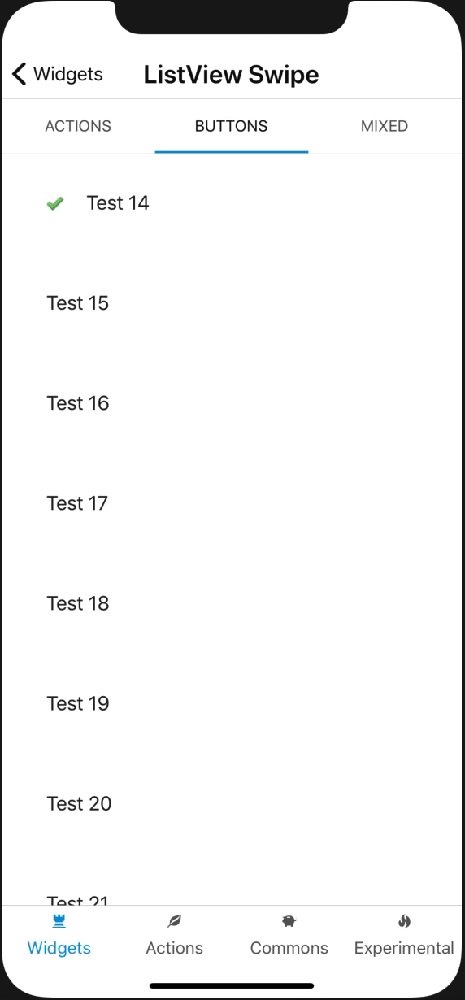
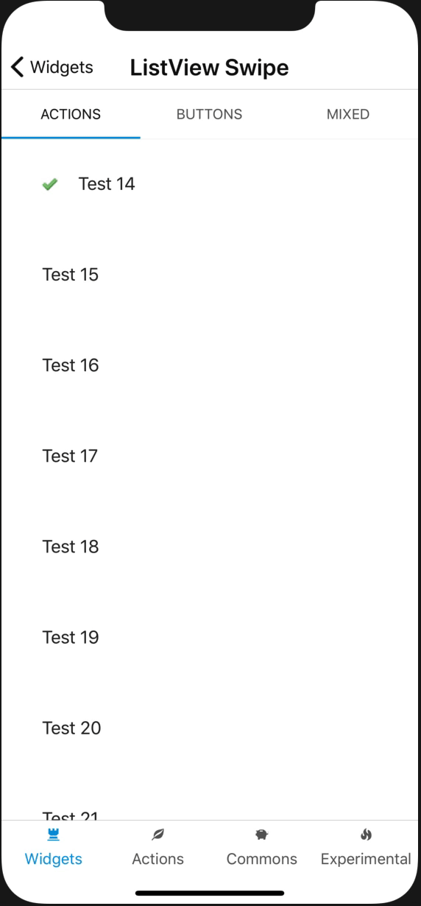
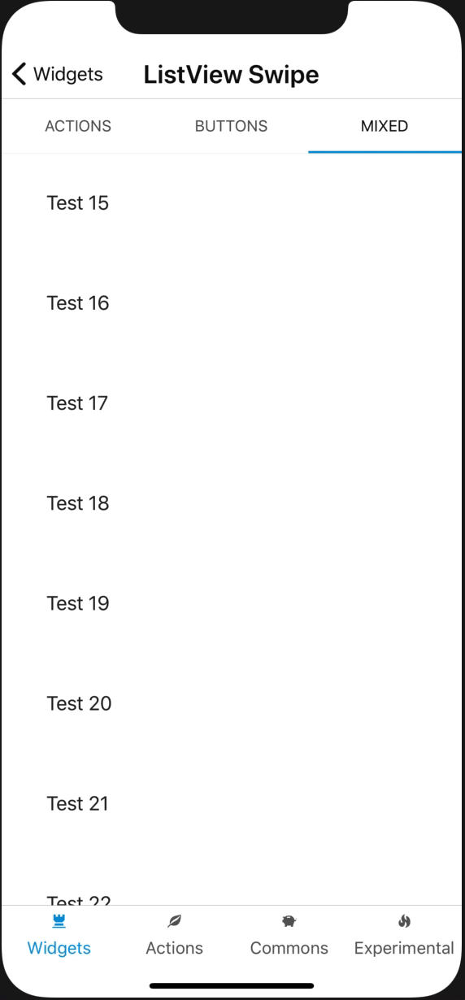
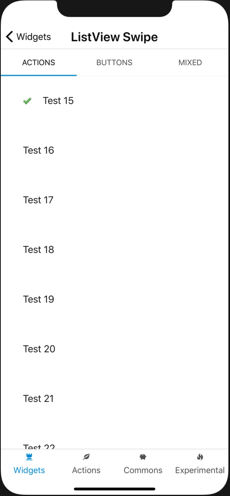

# List view swipe

Show controls on swipe for an interactive list view.

## Available patterns

### Show options (buttons)

### Swipe out and collapse

### Swipe out and reset

### Toggle

# How to se

-   Simply drag and drop components from the toolbar inside the widget. The widget doesnt need a context.
