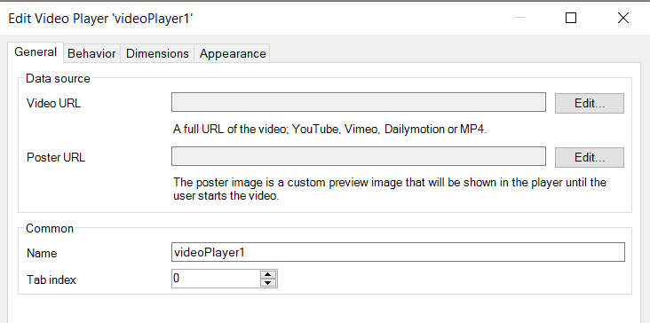
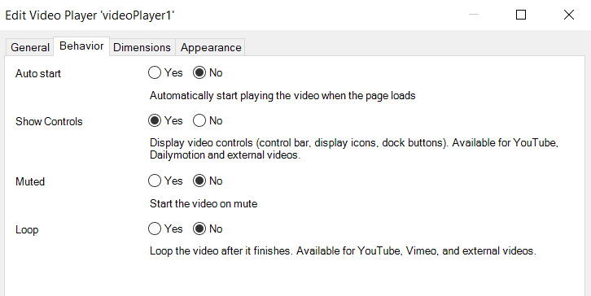
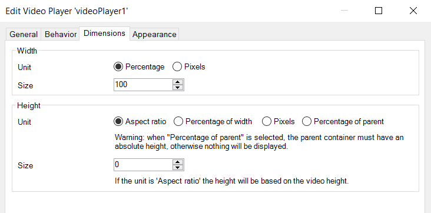

# Video Player

Mendix widget to play videos from Youtube, Vimeo, Dailymotion and external Mp4 files.

## Features

-   Identify the provider and auto load the right player
-   Enable and disable controls bar
-   Loop the video when it finishes
-   Starts the video on mute
-   Auto play the video when it ready
-   Define poster image for external Mp4 files
-   Set static URL & Poster when the dynamic data is not specified

## Dependencies

Mendix Studio / Mendix Studio Pro 8

## Usage

Place the widget inside or outside a context of an object that has a value attribute. If you don`t place the widget
inside a context, you need to provide a static URL otherwise the player will not render.

 


## Development project

[https://videoplayer-sandbox.mxapps.io/](https://videoplayer-sandbox.mxapps.io/)

### Phonegap/Cordova configuration

If your are developing a Hybrid Mobile App, please add these line through your Sprint in Mobile App -> Custom
Phonegap/Cordova configuration These lines are required to allow the access to YouTube, Vimeo, Dailymotion videos and
Mp4 extensions. Noembed.com is the API we use to request the Video Sizes to calculate Aspect Ratio.

```xml
<allow-navigation href="*://*youtube.com/*" />
<allow-navigation href="*://*youtu.be/*" />
<allow-navigation href="*://*ytimg.com/*" />
<allow-navigation href="*://*dailymotion.com/*" />
<allow-navigation href="*://*vimeo.com/*" />
<allow-navigation href="*://*noembed.com/*" />
<allow-navigation href="*://*.mp4" />
```

### Limitations

-   File hosted in Mendix Server cannot be played in Safari browser
